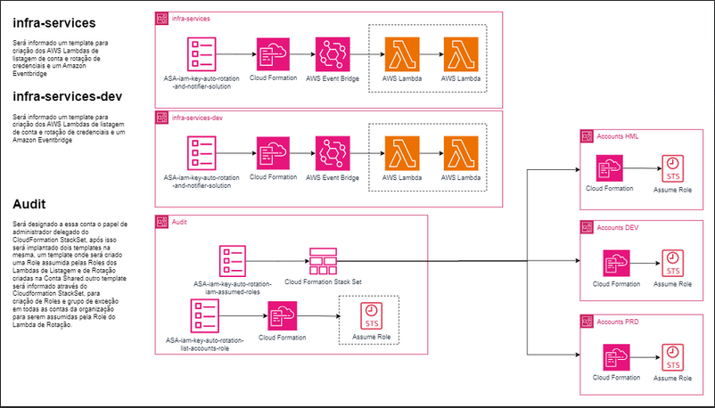

# IAM Key Rotation Runbook - Customizado

## Introdução

Este documento fornece orientações detalhadas sobre como configurar a rotação de chaves IAM utilizando AWS CloudFormation, Lambda Functions, e AWS Secrets Manager. Antes de continuar,[ **leia a documentação original fornecida**](Docs/ASA%20IAM%20Key%20Rotation%20Runbook(v3).pdf) para entender o contexto completo e a arquitetura utilizada para a rotação das chaves IAM.  

### Alterações Importantes

Nesta versão do template, foram realizadas algumas mudanças importantes na estrutura e no funcionamento do sistema de rotação de chaves IAM. Essas mudanças foram projetadas para aprimorar o gerenciamento das credenciais centralizadas na conta de auditoria e o controle de permissões com base em tags.


## Visão Geral da Arquitetura

A arquitetura é composta por três contas principais:

- **Conta de Infraestrutura-Dev:** Responsável pela rotação de credenciais nas contas de desenvolvimento (DEV) e homologação (HML).
- **Conta de Infraestrutura-PRD:** Responsável pela rotação de credenciais na conta de produção (PRD).
- **Conta de Auditoria:** Centraliza todas as credenciais rotacionadas das contas DEV, HML, e PRD.

A função Lambda de rotação será executada separadamente em ambas as contas de infraestrutura (DEV e PRD), mas as credenciais serão armazenadas de forma centralizada na **Conta de Auditoria**.

### Regras de Rotação por Tag

- A conta de **Infraestrutura-Dev** rotacionará as credenciais das contas DEV e HML. Nessas contas, as **roles** a serem assumidas para rotação precisam possuir a tag `tag-dev`.
- A conta de **Infraestrutura-PRD** rotacionará as credenciais da conta PRD, e as **roles** a serem assumidas devem possuir a tag `tag-prd`.

## Pré-requisitos para IAM Existente

Se uma credencial IAM já existir em uma conta, é necessário criar um **secret** correspondente no AWS Secrets Manager antes de iniciar a rotação. Siga este padrão ao criar os segredos:

- **Nome:** `Account_(IDACCOUNT)_User(USERNAME)_AccessKey`
- **Descrição:** `Auto-created secret`
- **Chave-Valor:**
  - **UserName:** `(USERNAME)`

A política padrão que deve ser aplicada a esses segredos é a seguinte:

```json
{
  "Version": "2012-10-17",
  "Statement": [
    {
      "Effect": "Allow",
      "Principal": {
        "AWS": "arn:aws:iam::(AccountID):user/(UserName)"
      },
      "Action": [
        "secretsmanager:GetSecretValue",
        "secretsmanager:DescribeSecret",
        "secretsmanager:ListSecretVersionIds",
        "secretsmanager:ListSecrets"
      ],
      "Resource": "*"
    }
  ]
}
```
## Delegação de Permissões

A conta de auditoria será designada como administradora delegada para o **StackSets** de CloudFormation, para que possa listar e gerenciar as credenciais IAM das outras contas.

## Centralização do Secrets Manager

Caso queira centralizar o **Secrets Manager** em contas diferentes, será necessário aplicar o template de listagem de contas separadas por ambiente, ou seja, **audit-dev** e **audit-prd**, e realizar o mesmo processo de segregação de permissão por **tag de ambiente** conforme feito no processo de **assume role**. Isso garantirá que as permissões para as rotinas de rotação de credenciais estejam corretamente aplicadas para cada ambiente.

## Templates de Terraform

Para facilitar a criação das contas com as configurações corretas, disponibilizamos um template de [Terraform](terraformForAFT/main.tf)
 que cria automaticamente as **roles** com suas respectivas tags para as novas contas. Esse template deve está localizado na pasta `customization` dentro do ambiente desejado do AFT.  

Certifique-se de que todas as novas contas recebam as **roles** adequadas e que estejam configuradas para serem gerenciadas corretamente pelas funções de rotação.

## Próximos Passos

1. Verifique se todas as **roles** e permissões necessárias foram criadas nas contas corretas.
2. Aplique os templates de Terraform nas novas contas para garantir que as tags e configurações estejam corretas.
3. Inicie a rotação e verifique se as credenciais estão sendo centralizadas na conta de auditoria conforme o esperado.


### Pontos principais abordados no README:
1. **Arquitetura dividida** entre contas de DEV/HML e PRD, com as credenciais sendo centralizadas na conta de auditoria.
2. **Regras de rotação baseadas em tags** (tag-dev para DEV/HML e tag-prd para PRD).
3. **Criação de segredos no Secrets Manager** para credenciais já existentes, com uma política específica.
4. **Uso de templates de Terraform** para garantir que as novas contas sejam criadas com as permissões e roles corretas.
5. **Delegação de permissões** através de StackSets para a conta de auditoria.
